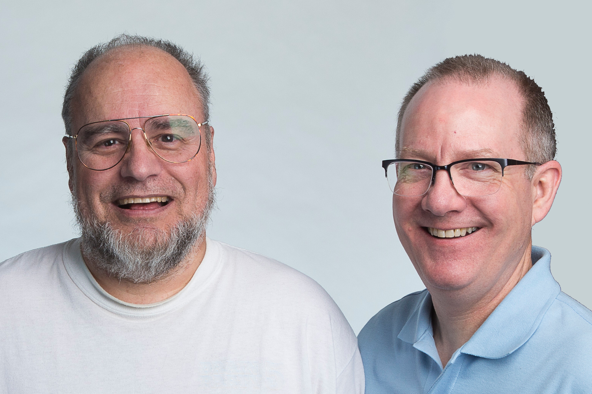

# VDF Alliance FPGA Competition – Round 1

### September 30, 2019

## Team Name
Geriatric Guys with Gates

## Team Members
* Steve Golson
* Kurt Baty

## Round 1 Results

|                | Constraint |
|---------------:|:----------:|
|Clock frequency | 196 MHz    |
|   Clock period | 5.102 ns   |

which using SDAccel flow gives

|                | Result    |
|---------------:|:---------:|
|            WNS | –0.518 ns |
|Clock frequency | 177.9 MHz |
|   Clock period | 5.620 ns  |

### Overall latency = 8 x period = 8 x 5.620 ns = 44.96 ns

### Improvement over 50ns baseline = 5.04 ns

This design should run correctly at the AWS F1 nominal frequency of 177 MHz (actually 177.083333 MHz).

## Design Description
We started with the Ozturk 1024b 8-cycle baseline design. The critical path is through the compressor, so that was an obvious place to start.

Ozturk used a simple 3-to-2 compressor. The selected Xilinx part supports LUTs with six inputs, thus a 6-to-3 compressor is suitable. This can be implemented with three LUT6. Each LUT6 is a single logic level, which overall saves much time on the critical path.

In the main state machine, several critical control signals were re-coded to come straight from flops. These signals have heavy fanouts and need to be generated as fast as possible.

Several changes were made to the synthesis and implementation settings. phys_opt is run post-placement and post-route.

The design is overconstrained (tight clock period) to get optimum results.

## Contributions by Team Members

### Kurt Baty
* Algorithm development
* Compressor design and coding
* Xilinx expertise
* Arguing with Vivado

### Steve Golson
* Design and project management
* Flow development for synthesis and implementation
* RTL speedups
* Strenuous arguing with Vivado

## Team Photo

Kurt Baty and Steve Golson